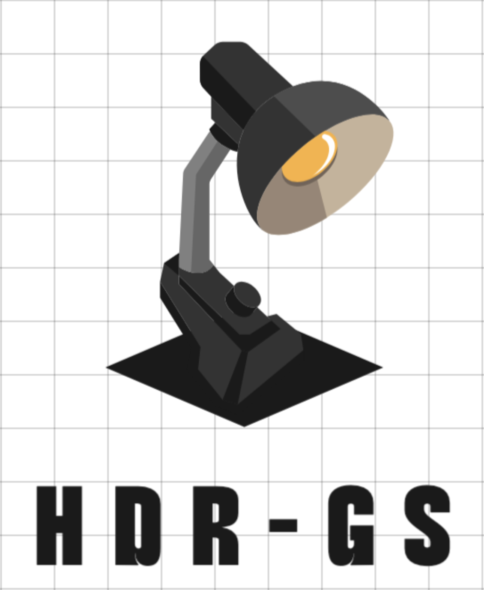
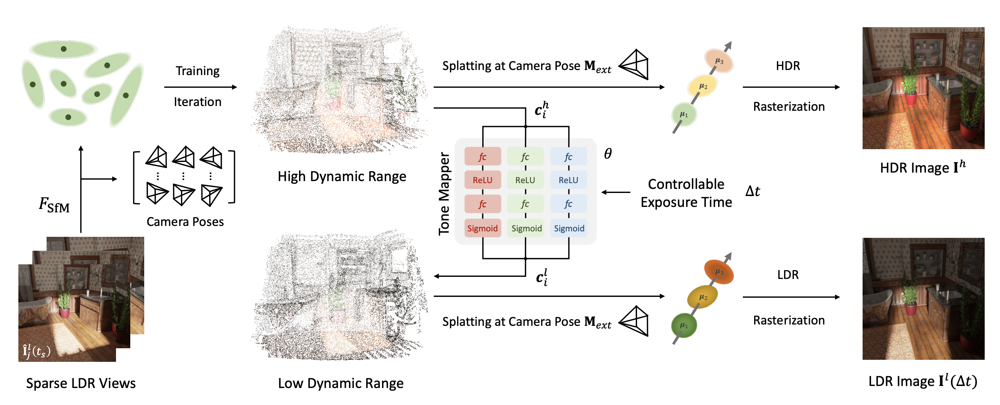

&nbsp;

<div align="center">

<p align="center">  </p>

[](https://paperswithcode.com/sota/novel-view-synthesis-on-hdr-gs?p=hdr-gs-efficient-high-dynamic-range-novel)

[](https://arxiv.org/abs/2405.15125)
[](https://www.youtube.com/watch?v=wtU7Kcwe7ck)
[](https://zhuanlan.zhihu.com/p/10016024329)
[](https://x.com/_akhaliq/status/1794921228462923925?s=46)
[](https://x.com/janusch_patas/status/1794932286397489222?s=46)


<h4>HDR-GS: Efficient High Dynamic Range Novel View Synthesis at 1000x Speed via Gaussian Splatting</h4> 

|                          *Scene Bathroom*                           |                          *Scene Chair*                           |                          *Scene Dog*               
| :----------------------------------------------------------: | :----------------------------------------------------------: | :----------------------------------------------------------: |
|  |  |  |

|                          *Scene Bear*                           |                          *Scene Desk*                           |                          *Scene Sponza*               
| :----------------------------------------------------------: | :----------------------------------------------------------: | :----------------------------------------------------------: |
|  |  |  |

&nbsp;

</div>


### Introduction
This is the official implementation of our NeurIPS 2024 paper "HDR-GS: Efficient High Dynamic Range Novel View Synthesis at 1000x Speed via Gaussian Splatting". We have run the SfM algorithm to recalibrate the data. If you find this repo useful, please give it a star ⭐ and consider citing our paper. Thank you.



### News
- **2024.12.01 :** We provide code for direct loading model to test and render spiral demo video. Welcome to have a try! 🤗
- **2024.11.30 :** We set up a leaderboard on the [paper-with-code](https://paperswithcode.com/sota/novel-view-synthesis-on-hdr-gs) website! Welcome to submit your entry! 🏆
- **2024.11.26 :** Code, recalibrated data following the opencv standard, and training logs have been released. Feel free to check and have a try! 🤗
- **2024.07.01 :** Our HDR-GS has been accepted by NeurIPS 2024! Code will be released before the start date of the conference (2024.12.10). Stay tuned. 🚀
- **2024.05.24 :** Our paper is on [arxiv](https://arxiv.org/abs/2405.15125) now. Code, data, and training logs will be released. Stay tuned. 💫

### Performance

<details close>
<summary><b>Synthetic Datasets</b></summary>


</details>

<details close>
<summary><b>Real Datasets</b></summary>


</details>

&nbsp;

### Interactive Results
|                          *Scene Bathroom*                           |                          *Scene Chair*                           |                          *Scene Diningroom*                           |
| :----------------------------------------------------------: | :----------------------------------------------------------: | :----------------------------------------------------------: |
| [](https://imgsli.com/MzIzNTAw) | [](https://imgsli.com/MzIzNTAx) | [](https://imgsli.com/MzIzNTAy) |

|                          *Scene Dog*                           |                          *Scene Sofa*                           |                          *Scene Sponza*                           |
| :----------------------------------------------------------: | :----------------------------------------------------------: | :----------------------------------------------------------: |
| [](https://imgsli.com/MzIzNTA0) | [](https://imgsli.com/MzIzNTA1) | [](https://imgsli.com/MzIzNTA2) |


&nbsp;

## 1. Create Environment

We recommend using [Conda](https://docs.conda.io/en/latest/miniconda.html) to set up the environment.

``` sh
# cloning our repo
git clone https://github.com/caiyuanhao1998/HDR-GS --recursive


SET DISTUTILS_USE_SDK=1 # Windows only

# install the official environment of 3DGS
cd HDR-GS
conda env create --file environment.yml
conda activate hdr_gs
```


&nbsp;

## 2. Prepare Dataset

Download our recalibrated and reorganized datasets from [Google drive](https://drive.google.com/file/d/1-9K8_iFwFH3SeTcRoaOTed-h9GBdRrrr/view?usp=sharing). Then put the downloaded datasets into the folder `data_hdr/` as

```sh
  |--data_hdr
    |--synthetic
      |--bathroom
        |--exr
          |--0.exr
          |--1.exr
          ...
        |--images
          |--0_0.png
          |--0_1.png
          ...
        |--sparse
          |--0
            |--cameras.bin
            |--images.bin
            |--points3D.bin
            |--points3D.ply  
            |--project.ini
      |--bear
      ...
    |--real
      |--flower
        |--input_images
          |--000_0.jpg
          |--000_1.jpg
          ...
        |--poses_bounds_exps.npy
        |--sparse
          |--0
            |--cameras.bin
            |--images.bin
            |--points3D.bin
            |--points3D.ply  
            |--project.ini
      |--computer
      ...
```

`Note:` The original datasets are collected by [HDR-NeRF](https://arxiv.org/abs/2111.14451). But the camera poses follow the normalized device coordinates, which are not suitable for 3DGS. Besides, HDR-NeRF does not provide the initial point clouds. So we use the Structure-from-Motion algorithm to recalibrate the camera poses and generate the initial point clouds. We also organize the datasets according to the description of HDR-NeRF, which is different from its official repo.

&nbsp;

## 3. Testing
We write the code for directly loading the model to test and render spiral video. Please download our pre-trained weights `bathroom` from [Google Drive](https://drive.google.com/drive/folders/139XpnbMmDkY6eyAcqqqqersYPj8oLo3v?usp=sharing) and then put it into the folder `pretrained_weights`.
```shell
# For synthetic scenes
python3 train_synthetic.py --config config/bathroom.yaml --eval --gpu_id 0 --syn --load_path pretrained_weights/bathroom  --test_only
```
Besides, if you train a model with config: ```bathroom.yaml```, you will get a profile as:
```sh
  |--output
    |--mlp
      |--bathroom
        |--exp-time
          |--point_cloud
            |interation_x
              |--point_cloud.ply
              |--tone_mapper.pth
            ...
          |--test_set_vis
          |--videos
          |--cameras.json
          |--cfg_args
          |--input.ply
          |--log.txt
```
Then the ```--load_path``` should be ``` "output/mlp/bathroom/exp-time/point_cloud/interation_x"```


## 4. Training
We provide training logs for your convienience to debug. Please download them from the [Google Drive](https://drive.google.com/drive/folders/1lI2nZ51pcW12xaiNFJjvoaHeuawj1dRt?usp=drive_link).


You can run the `.sh` file by
```shell
# For synthetic scenes
bash train_synthetic.sh

# for real scenes
bash train_real.sh
```

Or you can directly train on specific scenes as
```shell
# For synthetic scenes
python3 train_synthetic.py --config config/sponza.yaml --eval --gpu_id 0 --syn

python3 train_synthetic.py --config config/sofa.yaml --eval --gpu_id 0 --syn

python3 train_synthetic.py --config config/bear.yaml --eval --gpu_id 0 --syn

python3 train_synthetic.py --config config/chair.yaml --eval --gpu_id 0 --syn

python3 train_synthetic.py --config config/desk.yaml --eval --gpu_id 0 --syn

python3 train_synthetic.py --config config/diningroom.yaml --eval --gpu_id 0 --syn

python3 train_synthetic.py --config config/dog.yaml --eval --gpu_id 0 --syn

python3 train_synthetic.py --config config/bathroom.yaml --eval --gpu_id 0 --syn

# for real scenes
python3 train_real.py --config config/flower.yaml --eval --gpu_id 0

python3 train_real.py --config config/computer.yaml --eval --gpu_id 0

python3 train_real.py --config config/box.yaml --eval --gpu_id 0

python3 train_real.py --config config/luckycat.yaml --eval --gpu_id 0
```


&nbsp;

## 4. Citation
```sh
@inproceedings{hdr_gs,
  title={HDR-GS: Efficient High Dynamic Range Novel View Synthesis at 1000x Speed via Gaussian Splatting},
  author={Yuanhao Cai and Zihao Xiao and Yixun Liang and Minghan Qin and Yulun Zhang and Xiaokang Yang and Yaoyao Liu and Alan Yuille},
  booktitle={NeurIPS},
  year={2024}
}
```
